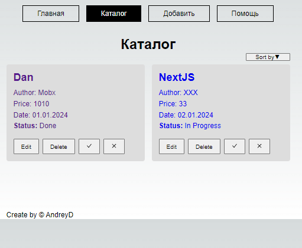
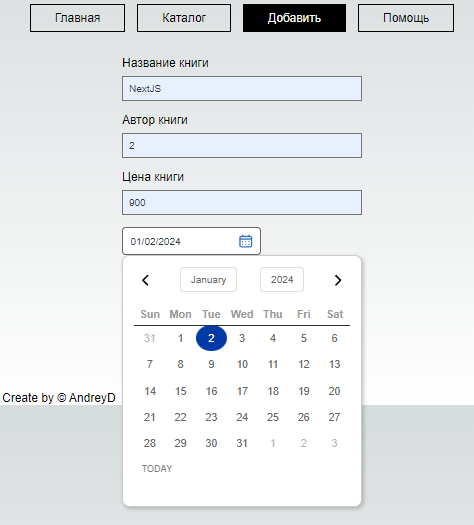
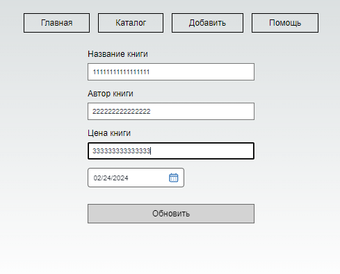
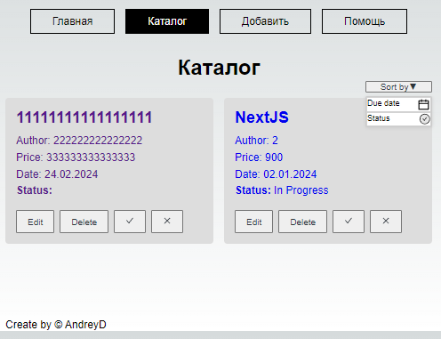

# React-todo-list

[//]: # (#### A project built for resurrecting the countless abandonware repos littering GitHub. The goal is to make it easier to turn any repo, no matter how old, and turn it into a working GitHub Codespace.)
#### Showcasing the use of local storage in Next.js with TypeScript, utilizing hooks and context.
#### Committed to making Bootstrap project the best note-making app possible. If you have any feedback, suggestions, or encounter any issues, please let us know by opening an issue on GitHub.
[//]: # (Thank you for choosing NextJS. We hope you enjoy this release, and we look forward to enhancing your note-taking journey in the future!)

## 📖 TODO
- Recycle knowledge and refresh mind
- < code />


-------------------------------------------------

### ⚙️ Technology Stack


-------------------------------------------------
### 📝 Local State management
Context data is stored in local storage.


-------------------------------------------------
### ‍💻 Getting Started
```bash
npm run dev
# or
yarn dev
```
-------------------------------------------------
## ⚙️ Advancement
The demo app is a static site, a basic single-page-app that has a few
addressable pages that are lazy loaded on-demand. It demonstrates basic CRUD
operations: 1) list todo, 2) view todo details, 3) create/edit and 4)
delete a todo.

The demo uses browser localStorage for the data storage, which means it runs
without a backend.

#### A project built for resurrecting a stalled project requires a close look at what circumstances have changed, and then changing the plan to match the current reality.

### 📸 Screenshots





#### 💡 Adding library
Install library  from NPM:

```bash
npm i react-use
```
```bash
npm install uuid
```
```bash
npm install react-icons --save
```
```bash
npm i rc-dropdown
```
```bash
npm i rc-menu
```
```bash
npm install @gsebdev/react-simple-datepicker
```
```bash
npm i sass
```

### 🌐 Learn More

Original project : [`book-management-app`](https://github.com/candraKriswinarto/book-management-app) - https://github.com/candraKriswinarto/book-management-app .

### Video Tutorial

You can see my youtube video for this project in [here](https://youtu.be/55MMOh49Oho)

> Work in Progress


### Getting Started

First, run the development server:

```bash
npm run dev
# or
yarn dev
```

Open [http://localhost:3000](http://localhost:3000) with your browser to see the result.

### 🎁 Expected outcome
- ✅ Your project must be hosted on GitHub. (you can use the gh-pages to have a running version online or vercel)
- ✅ Your project must contain a README that explains how to run it.
- ✅ If some user stories are not clear enough, you can take arbitrary decisions.
- ✅ If you don't have time to finish all the user stories, describe the way you'd do them.
- ✅ Describe the edges you don't handle.
- ✅ This project is a real use case at todo List, put the same attention to this project that you would in your real work.


-------------------------------------------------
-------------------------------------------------
-------------------------------------------------
### 🔧 Functionality

The Task Management App have following functionalities:

- Title: A title describing the task.
- Status: The current status of the task (e.g., "To Do", "In Progress", "Completed").
- CRUD: Functionality to perform CRUD (Create, Read, Update, Delete).
- Stores the task data using local storage.

-------------------------------------------------
### 📄 Project Structure

The repository follows the following structure:

- `/public`: Contains public assets and the app's logo.
- `/src`: Contains children folders like "app", "components", and "store".
- `/src/app`: Contains the main page of the application.
- `/src/components`: Contains reusable components used throughout the application.
- `/src/context`: App context set up. Can be used to store data, that only needs to be fetched once, but is needed in multiple places.
- `/src/hooks`: React Hooks library for data fetching.

-------------------------------------------------

